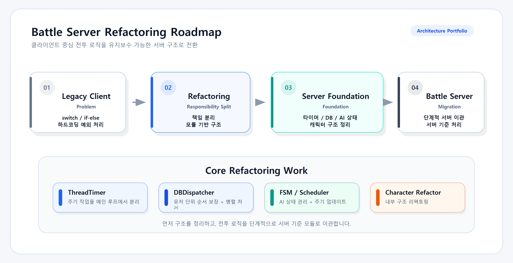
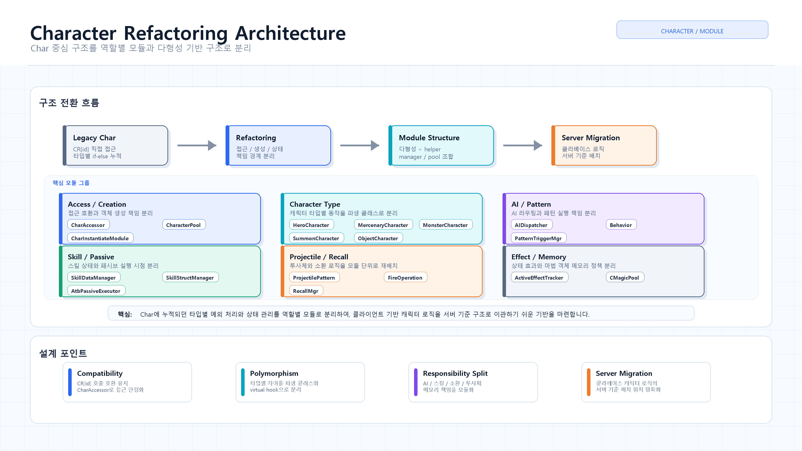
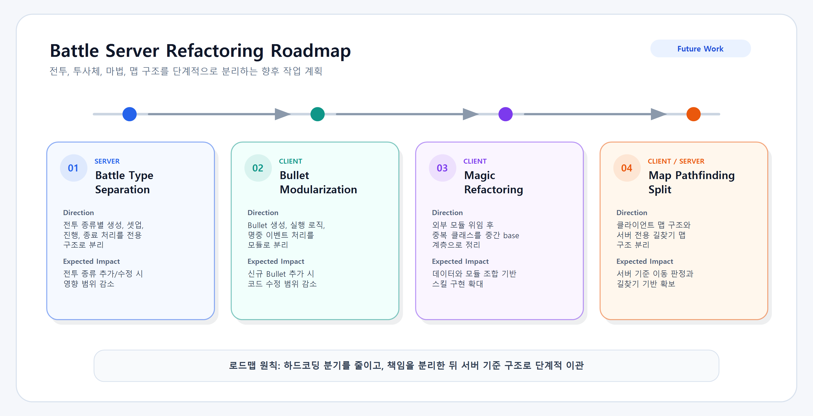

# Battle Server Architecture Refactoring

> C++ 기반 게임 서버 전환을 위해 클라이언트 중심의 전투, 캐릭터, AI 처리 흐름을 서버 기준 구조로 재정리한 작업입니다.

이 문서는 배틀서버 전환 과정에서 진행한 구조 개선 작업을 포트폴리오용으로 정리한 README입니다.  
핵심은 클라이언트 로직을 서버로 단순 복사하는 것이 아니라, 기존 기술부채를 정리하고 서버에서 유지보수 가능한 구조로 단계적으로 이관하는 것입니다.

## Tech Keywords

`C++` `Game Server` `Multithreading` `Task Scheduler` `FSM` `Object Pool`  
`Polymorphism` `Refactoring` `Server Architecture` `DB Dispatching`

## Summary

| Category | Description |
| --- | --- |
| Project Goal | 클라이언트 중심 전투/캐릭터/AI 로직을 서버 기준 구조로 전환 |
| Main Problem | 하드코딩 조건문, 매직넘버, 중복 구현, 타입별 예외 처리 누적 |
| Core Strategy | 기능을 그대로 이관하지 않고, 역할별 모듈과 객체지향 구조로 재정리 |
| Main Work | ThreadTimer, DBDispatcher, FSM / TaskScheduler, Character Refactoring |
| Expected Impact | 메인 루프 부하 감소, DB 병목 완화, 서버 AI 기반 확보, 수정 영향 범위 축소 |

## Related Repositories

배틀서버 구조 개선 작업 중 일부는 별도 리포지토리로 정리되어 있습니다.

| Repository | Description | Role in Battle Server Refactoring |
| --- | --- | --- |
| [ThreadTimer](https://github.com/beckhamRealMadrid/ThreadTimer) | IOCP 기반 비동기 타이머 / 스케줄러 시스템 | 메인 루프에 몰려 있던 주기성 작업을 별도 타이머 구조로 분리 |
| [DBDispatcher](https://github.com/beckhamRealMadrid/DBDispatcher) | 유저 단위 직렬화와 워커 스레드 기반 병렬 DB 처리 시스템 | 같은 유저의 DB 요청 순서를 보장하면서 전체 DB 처리 병목 완화 |
| [FSM](https://github.com/beckhamRealMadrid/FSM) | 게임 서버 AI를 위한 FSM 기반 상태 관리 시스템 | 몬스터 AI 서버 이전을 위한 상태 관리와 상태 전환 기반 확보 |
| Character Refactoring | Private / Internal Refactoring | `Char` 중심 예외 처리 구조를 다형성, helper, manager, pool 조합 구조로 분리 |

## My Contribution

- 메인 스레드에 몰려 있던 주기성 작업을 분리하기 위한 `ThreadTimer` 구조 정리
- 유저 단위 DB 요청 순서를 보장하면서 병렬 처리가 가능한 `DBDispatcher` 구조 정리
- 몬스터 AI 서버 이전을 위한 `FSM / TaskScheduler` 기반 구조 설계
- `Char` 중심의 예외 처리 구조를 다형성, helper, manager, pool 조합 구조로 리팩토링
- 향후 전투, Bullet, Magic, Map 구조를 서버 기준으로 이관하기 위한 개선 방향 정리

## Problem

기존 클라이언트 코드에는 오래 누적된 하드코딩 조건 처리, 매직넘버, 중복 구현, 타입별 예외 처리 로직이 많이 남아 있었습니다. 특히 캐릭터, 스킬, 총알, 마법, 전투 관련 로직은 거대한 `switch` / `if-else` 구조에 의존하는 부분이 많았습니다.

이 구조에서는 신규 콘텐츠가 추가될 때마다 기존 함수와 분기문을 수정해야 하고, 특정 타입을 위한 예외 처리가 다른 기능에 영향을 줄 가능성도 커집니다.

따라서 서버 베이스 전환 과정에서 기존 클라이언트 로직을 그대로 이관하면 서버 코드에도 동일한 복잡도와 유지보수 부담이 누적될 수 있었습니다.

## Approach

서버 이관은 단순한 코드 복사가 아니라, 지속적인 콘텐츠 업데이트를 감당할 수 있는 서버 기준 구조로 재구성하는 과정으로 접근했습니다.

### Migration Flow

| Step | Description |
| --- | --- |
| Legacy Client Logic | 클라이언트 중심으로 누적된 전투, 캐릭터, AI 처리 흐름 |
| Refactoring | ThreadTimer, DBDispatcher, FSM, Character Refactoring을 통해 책임 분리 |
| Server-side Foundation | 서버에서 안정적으로 처리할 수 있는 타이머, DB, 상태 관리, 캐릭터 구조 확보 |
| Battle Server Migration | 정리된 구조 위에서 전투/AI/캐릭터 로직을 단계적으로 서버 기준으로 이관 |

핵심 방향은 다음과 같습니다.

- 시간 기반 작업을 메인 루프에서 분리
- DB 요청을 유저 단위 큐와 워커 스레드 기반으로 분산 처리
- 몬스터 AI 서버 이전을 위해 상태 관리와 주기 업데이트 구조 확보
- `Char` 중심 구조에 누적된 타입별 예외 처리를 역할별 모듈로 분리
- C++의 캡슐화, 추상화, 상속, 다형성을 활용해 확장 가능한 구조로 전환

## Completed Work

| Area | Work | Purpose | Result |
| --- | --- | --- | --- |
| Server | [ThreadTimer](https://github.com/beckhamRealMadrid/ThreadTimer) | 메인 스레드에 몰려 있던 주기성 작업 분리 | 메인 루프 부하 감소, 정기 작업 관리 구조 개선 |
| Server | [DBDispatcher](https://github.com/beckhamRealMadrid/DBDispatcher) | DB 요청 병목 해소 및 유저 단위 처리 순서 보장 | DB 처리 지연 감소, 데이터 불일치 가능성 감소 |
| Server | [FSM / TaskScheduler](https://github.com/beckhamRealMadrid/FSM) | 몬스터 AI 서버 이전을 위한 상태 관리 기반 구축 | 몬스터 상태 전환 및 주기 업데이트 기반 확보 |
| Client | Character Structure Refactoring `Private / Internal` | `Char` 중심의 하드코딩 예외 처리 구조 개선 | 캐릭터 타입 확장성 개선, 서버 이관 위치 명확화 |

## Architecture Improvements

### 1. [ThreadTimer](https://github.com/beckhamRealMadrid/ThreadTimer)

메인 스레드에서 처리하던 시간 기반 작업을 별도 타이머/스케줄러 구조로 분리했습니다.

**Before**

- 일일/주간/월간 초기화가 메인 루프에서 함께 처리
- 콘텐츠 오픈/종료, 랭킹 갱신, 상점 갱신 등이 메인 스레드에 영향
- DB 조회/갱신이 포함된 정기 작업이 서버 응답성에 영향을 줄 수 있음

**After**

- `CThreadTimer`로 타이머 스레드 관리
- `CTimer`로 개별 타이머의 실행 주기와 다음 실행 시점 관리
- `CTaskScheduler`로 특정 시점의 예약 작업 관리
- 반복 작업과 one-shot 작업을 같은 구조에서 처리

**Impact**

- 메인 루프가 게임 진행 핵심 처리에 집중할 수 있음
- 신규 타이머 작업 추가 시 메인 루프 수정 범위 감소
- 정기 작업을 ID와 핸들러 기준으로 일관되게 관리

### 2. [DBDispatcher](https://github.com/beckhamRealMadrid/DBDispatcher)

같은 유저의 DB 요청 순서는 보장하고, 서로 다른 유저의 요청은 병렬로 처리할 수 있도록 구성했습니다.

**Before**

- DB 요청이 단일 큐 또는 제한된 처리 흐름에 집중
- 특정 요청 지연 시 뒤에 쌓인 요청까지 함께 지연
- 특정 유저나 콘텐츠의 DB 요청이 다른 유저 처리까지 영향

**After**

- `CDBDispatcher`가 전체 DB 요청 등록과 워커 스레드 분배 담당
- `CUserDBQueue`로 같은 유저의 요청 순서 보장
- `CDBMsg` / `CDBMsgPool`로 요청 메시지 재사용
- `CSemaphoreChannel`로 워커 스레드 대기/깨우기 처리

**Impact**

- 유저 데이터 저장 순서 보장
- 서로 다른 유저의 요청을 병렬 처리하여 DB 처리 지연 완화
- 반복적인 요청 객체 생성 비용 감소

### 3. [FSM / TaskScheduler](https://github.com/beckhamRealMadrid/FSM)

몬스터 AI를 서버 기준으로 처리하기 위한 상태 관리와 주기 업데이트 기반을 구축했습니다.

**Before**

- 몬스터 AI 로직이 클라이언트 코드에 존재
- 서버에서 몬스터 상태 흐름을 관리하기 위한 기반 구조 부족
- 메인 루프에서 직접 처리할 경우 몬스터 수 증가에 따른 부하 관리 어려움

**After**

- 몬스터 상태를 FSM으로 관리
- 상태별 진입 처리, 업데이트 처리, 전환 조건 분리
- `TaskScheduler`를 통해 FSM 업데이트를 일정 주기로 실행

**Impact**

- 몬스터 AI 서버 이전을 위한 상태 관리 기반 확보
- 상태 단위로 AI 로직을 확장하기 쉬운 구조 마련
- 메인 루프에 AI 업데이트가 직접 몰리는 문제 완화

### 4. Character Structure Refactoring

> Private / Internal Refactoring  
> 코드 공개 리포지토리는 없지만, 배틀서버 이관을 위한 핵심 선행 리팩토링 작업입니다.

기존 `Char` 중심 구조에 누적된 타입별 조건 분기, 전역 접근, 스킬별 상태 변수, 생성/재사용 책임을 역할별 모듈로 분리했습니다.

**Before**

- `Char` 내부에 타입별 예외 처리와 상태값이 계속 증가
- `CR[id]` 형태의 전역 배열 직접 접근
- 캐릭터 생성, 재사용, 초기화 책임이 명확히 분리되지 않음
- AI, 패턴, 패시브, 소환, 투사체, 총알 처리 로직이 조건문 중심으로 누적
- 마법 객체의 빈번한 `new/delete`로 힙 비용과 단편화 가능성 존재

**After**

- `CharAccessor`로 기존 `CR[id]` 호출 호환성을 유지하면서 내부 접근 제어
- `CharacterPool`, `CharInstantiateModule`로 생성과 재사용 책임 분리
- `HeroCharacter`, `MercenaryCharacter`, `MonsterCharacter`, `SummonCharacter` 등 타입별 파생 클래스 구성
- `AIDispatcher`, `PatternTriggerMgr`, `SkillDataManager`, `RecallMgr`, `CFireActionMgr` 등 역할별 manager/module 분리
- `CMagicPool`로 마법 객체 메모리 할당 정책 중앙화

**Impact**

- 캐릭터 타입별 예외 처리를 거대한 조건문 대신 다형성과 hook으로 분리
- 스킬 상태와 구조체 접근을 `Char` 본체에서 분리
- 소환, 투사체, 총알, 마법 객체 처리 위치 명확화
- 클라이언트 베이스 캐릭터 로직의 서버 이관 기반 확보

## Roadmap

| Area | Work | Direction | Expected Impact |
| --- | --- | --- | --- |
| Server | Battle Type Separation | 전투 종류별 생성, 셋업, 진행, 종료 처리를 전용 모듈 또는 파생 구조로 분리 | 전투 종류 추가/수정 시 영향 범위 감소 |
| Client | Bullet Modularization | Bullet 객체 인스턴싱, 실행 로직, 명중 이벤트 처리 모듈로 분리 | 신규 Bullet 추가 시 코드 수정 범위 감소 |
| Client | Magic Refactoring | 외부 모듈 위임 후 중간 base 계층으로 중복 클래스 정리 | 데이터와 module 조합 기반 스킬 구현 확대 |
| Client | Server Map Pathfinding | 클라이언트 v1/v2 맵 구조 정리 및 서버 전용 Map 구조 분리 | 서버 기준 이동 판정 기반 확보 |

## Result

이번 구조 개선을 통해 배틀서버 전환을 위한 기반을 단계적으로 정리했습니다.

- 메인 루프 부하 감소
- DB 처리 병목 완화
- 유저 단위 DB 처리 순서 보장
- 몬스터 AI 서버 이전 기반 확보
- 캐릭터 타입 확장성 개선
- 기능별 수정 영향 범위 감소
- 클라이언트 로직의 서버 이관 위치 명확화
